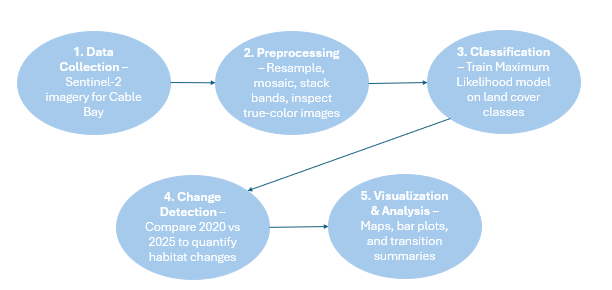

## Summary

My MGEM capstone projects takes a close look at the Cable Bay area in Nanaimo, BC to investigate spatial and temporal changes in shoreline habitats around Cable Bay using remote sensing and geomatics techniques. The project aims to provide a detailed understanding of how shoreline land cover types have shifted over the period 2020 to 2025, supporting conservation and environmental management efforts in the region.

Using high-resolution satellite imagery and geospatial analysis tools, the study identifies patterns in shoreline vegetation, intertidal zones, and other ecological features. The project leverages land cover classification, image differencing, and GIS-based spatial analysis to quantify habitat changes and map areas of significant ecological transformation.

This work highlights my interest in the intersection of ecology and geomatics, demonstrating how remote sensing can be applied to monitor environmental change, support data-driven decision-making, and inform environmental management practices. The findings of this project aim to provide valuable insights for the city of Nanaimo and conservation initiatives focused on the environmental preservation of the area.

## My Study Area

Below displays the study area for my capstone, the Cable Cay trail shoreline in Nanaimo, BC!

```{r leaflet-map, echo=FALSE, warning=FALSE, message=FALSE}
library(dplyr)
library(leaflet)

leaflet() %>%
  addProviderTiles("Esri.WorldImagery") %>%
  addScaleBar(position = "bottomleft") %>%
  setView(lng = -123.81988, lat = 49.13603, zoom = 15) %>%
  addMarkers(lng = -123.81988, lat = 49.13603, popup = "Target Location")
```

## My Methodology

Here is a workflow summarizing the methodology of this project.

{width="100%"}

::: {.panel-tabset group="language"}
## Preproccsing Code

``` {.r .(.r)}
calc_ndvi <- function(nir, red){
  ndvi <- (nir - red) / (nir + red)
  return(ndvi)
}
```

(Calculates NDVI from Sentinel-2 bands)

## Supervised Classification Code 

``` {.r .(.python)}
mlc_model <- superClass(
  img = sentinel_raster,
  trainData = training_polygons,
  valData = validation_polygons,
  responseCol = "lc_class",
  model = "rf",
  nSamples = 100
)
```

*(Trains a classification model to map land cover classes for 2025 Cable Bay data)*
:::

## Results through Figures

## Key Takeaways

Applied remote sensing and GIS techniques to monitor shoreline habitat changes in Cable Bay, Nanaimo, BC.

Quantified land cover transitions and habitat gains/losses using supervised classification and change detection.

Applied and strengthened skills learned in the MGEM program, including satellite image processing, spatial analysis, and geospatial visualization.

## Skills & Tools Applied

GIS & Mapping: QGIS, Leaflet, and ArcGIS

Programming & Data Analysis: R (terra, raster, sf,RStoolbox).

Data Visualization: Bar plots, maps, interactive dashboards

Environmental Applications: Habitat monitoring, shoreline conservation, spatial change analysis
